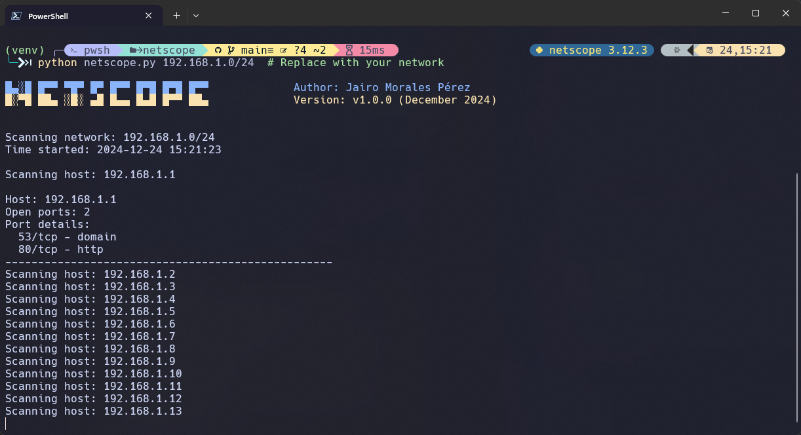

# NetScope

Ein leistungsfähiger Netzwerk-Scanner und Port-Analyzer, entwickelt in Python.



## 🌟 Hauptfunktionen

- Netzwerk-Scanning mit CIDR-Notation
- Parallele Port-Scans für verbesserte Geschwindigkeit
- Erkennung häufig genutzter Dienste
- Automatische Berichtserstellung im JSON-Format
- Konfigurierbare Port-Scan-Bereiche
- Benutzerfreundliche Kommandozeilen-Schnittstelle

## 📋 Voraussetzungen

- Python 3.8 oder höher
- pip (Python Package Installer)

## ⚙️ Installation

1. Klonen Sie das Repository:
```bash
git clone https://github.com/icky17/netscope.git
cd netscope
```

2. Installieren Sie die erforderlichen Pakete:
```bash
pip install -r requirements.txt
```

## 🚀 Verwendung

### Basis-Scan
Führen Sie einen Basis-Scan Ihres lokalen Netzwerks durch:
```bash
python netscope.py 192.168.1.0/24
```

### Erweiterte Optionen
Scannen Sie alle Ports (1-1024) und speichern Sie die Ergebnisse in einer benutzerdefinierten Datei:
```bash
python netscope.py 192.168.1.0/24 --all-ports -o custom_results.json
```

### Parameter
- `target`: Ziel-Netzwerk in CIDR-Notation (z.B. 192.168.1.0/24)
- `--output, -o`: Ausgabedatei für Ergebnisse (JSON-Format)
- `--all-ports, -a`: Scannt alle Ports (1-1024) statt nur der häufigen Ports

## 📊 Ausgabeformat

Die Ergebnisse werden in JSON-Format gespeichert und enthalten:
- IP-Adresse des Hosts
- Offene Ports
- Erkannte Dienste
- Zeitstempel des Scans

## ⚠️ Sicherheitshinweise

- Verwenden Sie dieses Tool nur in Netzwerken, für die Sie eine Berechtigung haben
- Beachten Sie lokale Gesetze und Vorschriften bezüglich Netzwerk-Scanning
- Das Tool könnte von Sicherheitssystemen als potenziell verdächtig eingestuft werden

## 📝 Lizenz

Dieses Projekt ist unter der MIT-Lizenz lizenziert - siehe [LICENSE](LICENSE) für Details.

## 🤝 Beitragen

Beiträge sind willkommen! Bitte lesen Sie [CONTRIBUTING.md](CONTRIBUTING.md) für Details zum Prozess.

## 👨‍💻 Autor

👤 **Jairo Morales**

- Github: [@Icky17](https://github.com/Icky17)
- Linkedin: [@Jairo Morales Pérez](https://www.linkedin.com/in/jairo-morales-p%C3%A9rez-67949b216/)
- Website: https://jairomorales.ch/